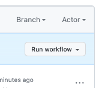
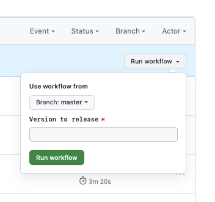

## Overview

An iOS app integrating Sentry to demo its various product features. See [Empower: How to Contribute](https://www.notion.so/sentry/Empower-How-to-Contribute-3190417cf9b14e7c895fb352d5c28bd6#0a64b16867e9418abc027f2450635510) for more information.

## Setup
- Install XCode
- In a terminal, run: 
    - `make init`
    - `sentry-cli login` (see [`sentry-cli` docs](https://docs.sentry.io/product/cli/) for more info) and use an **org-level** auth token from the `demo` org

## Run
Open EmpowerPlant.xcodeproj in Xcode and click the "Play" button or press ⌘R 

## Creating release and uploading app

- Ensure the Info.plist has the version you want to release on the `master` branch (the release job can actually currently run off of any branch that's been pushed to GitHub but this is not recommended; perhaps in the future this can be disallowed by some option in the workflow YAML)
- Go to the iOS demo repo's [Actions](https://github.com/sentry-demos/ios/actions) area
- Go to the [Release](https://github.com/sentry-demos/ios/actions/workflows/release.yml) action
- Click "Run workflow" dropdown box on the right [
- Enter the version number you want it to build and deploy and click "Run workflow" [

This runs the workflow defined in [release.yml](.github/workflows/release.yml). It uses the [secrets](https://github.com/sentry-demos/ios/settings/secrets/actions) configured in the repo for `SENTRY_AUTH_TOKEN`, `SENTRY_ORG`, `SENTRY_PROJECT` for `sentry-cli` auth/upload, and the automatic ephemeral [`GITHUB_TOKEN`](https://github.blog/changelog/2021-09-20-github-actions-ephemeral-self-hosted-runners-new-webhooks-for-auto-scaling/) for `gh` auth.

See https://github.com/sentry-demos/ios/releases/tag/0.0.1 for a sample release

Note: TDA must be restarted for it to pick up new version

## TDA

The command that runs this in TDA can be found here: https://github.com/sentry-demos/empower/blob/a77428aec6cb8e6563caf3d9671419461946db2e/tda/conftest.py#L480-L514
